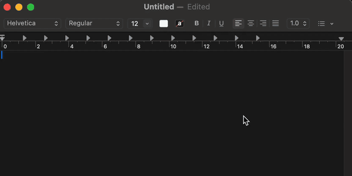

<div align="center">


# nib

**An offline writing assistant for macOS.**
Underlines mistakes in any app, offers the fix on hover, and never sends your text anywhere.

[](https://github.com/kushagra1212/nib/actions/workflows/ci.yml)
[](https://github.com/kushagra1212/nib/releases/latest)
[](LICENSE)



</div>

---

## Install

```sh
brew install --cask --no-quarantine kushagra1212/tap/nib
```

Or [download the DMG](https://github.com/kushagra1212/nib/releases/latest), drag
nib to Applications, and run `xattr -dr com.apple.quarantine /Applications/nib.app`.

> **Why the extra flag.** nib is not notarised — that needs a paid Apple
> Developer account — so Gatekeeper refuses to open it and offers only
> *Move to Trash*, saying it "could not verify nib is free of malware".
>
> macOS applies that block to anything carrying the quarantine attribute, which
> both a browser download **and Homebrew** attach. `--no-quarantine` tells
> Homebrew not to, which is why it is on the command above.
>
> If you have already installed it and hit the dialog, this clears it:
>
> ```sh
> xattr -dr com.apple.quarantine /Applications/nib.app
> ```
>
> Neither route avoids this on its own. Until nib is notarised, one of these is
> required whichever way you install.

### Grant Accessibility permission

nib reads the text you are editing through the macOS Accessibility API. It
cannot see anything until you allow it.

1. Launch nib. A pencil icon appears in the menu bar.
2. Approve the prompt, or open **System Settings → Privacy & Security →
   Accessibility** and switch **nib** on.
3. Start typing.

Requires **macOS 13 Ventura or later** on **Apple silicon**.

---

## Use

Type. Mistakes get underlined where you wrote them. Hover one for the fix.

| | Meaning |
|---|---|
| <span style="color:#e5484d">**Red**</span> | Spelling, grammar, punctuation |
| <span style="color:#0090ff">**Blue**</span> | The sentence could read more clearly |

Hovering shows a card with the change: the old wording struck through, the new
wording in its place. **Accept** applies it, **Dismiss** hides it, and the
arrows step through the rest.

Colours follow [Grammarly's convention](https://www.grammarly.com/blog/product/better-writing-with-grammarly/)
so the meaning is already familiar.

### The panel

Some apps do not report where their text sits on screen, so no underline can be
placed. Press **⌥Space** there instead: nib grabs the selection, shows the same
suggestions in a floating panel, and writes the result back.

The menu bar icon has **Check Selection** for the same thing without the hotkey.

### Command line

```sh
nib --lint "Their is many erors"     # check text and print suggestions
nib --rewrite "text to improve"      # run the three rewrite modes
nib --bench 2000                     # measure lint latency
nib --ax-probe 5                     # report what the focused field exposes
nib --live-probe 20                  # trace the inline pipeline
```

Handy once installed:

```sh
alias nib=/Applications/nib.app/Contents/MacOS/nib
```

---

## AI rewrite (optional)

Grammar checking works out of the box and needs no model.

The **Fix / Clearer / Shorter / Freely** buttons and the blue clarity underlines
run a language model locally. nib bundles the engine that runs it but no model,
because the smallest useful one is another 800MB and that is a choice worth
leaving open. Nothing leaves your machine either way.

**nib offers to set this up for you.** The first launch with no model installed
opens a window listing the models it knows, downloads the one you pick, checks
it loads by running a real correction through it, and switches the features on
without a restart. It is also under **Set Up AI Rewrite…** in the menu bar. If a
model is already installed, none of this appears.

To do it by hand instead, put any `.gguf` in
`~/Library/Application Support/nib/models` and restart nib.

There is no step for installing llama.cpp: a build of `llama-server` ships
inside the app, so the model is the only piece you supply. A Homebrew
installation is still used if one is there and the bundled copy is not, which
in practice means a checkout that has not run `Scripts/fetch-llama.sh`.

### Which model

**Qwen3 0.6B is the floor**, and it is the one nib preselects. Measured on four
sentences of ordinary mistakes, it corrected three: `we was going … buyed` and
`I have went` both came out right. It leaves homophones alone — `their/there/
they're` came back untouched — which is harper's job anyway, and those are the
underlines you get without any model at all.

Gemma 3 270M was tried and is not usable. It fixed only the misspellings, and
for "clearer" and "shorter" it *described* the sentence — returning
`"The sentence is too long and wordy."` in 0.04s — instead of rewriting it.
Anything smaller than 0.6B answers the wrong question.

**Bigger is not reliably better here**, which is why the list has one entry.

Qwen3 1.7B at Q4_K_M is 1.6× the size and was worse in every mode tried. It
corrected two of the four sentences against the 0.6B's three, returning
`we was going to the store` unchanged; asked to tighten a rambling sentence it
deleted the word "maybe" and left the rest, where the 0.6B rewrote it properly.

Qwen3 1.7B at Q8_0 is not offered because it could not be tested: at 2.2GB it
fails to run on a 16GB machine with a browser open, and llama.cpp reports
`kIOGPUCommandBufferCallbackErrorOutOfMemory`. nib now reports that as
*"not enough memory to run this model"* rather than as a parse failure.

None of this limits you to the list — **Choose File…** in the same window takes
any GGUF, and nib prefers the largest of the models it recognises.

---

## How it works

Three passes, ordered by cost, each superseding the last:

| Pass | Latency | Provides |
|---|---|---|
| [harper](https://writewithharper.com/) | ~30ms | Spelling and hard grammar |
| Local model | ~1.5s | Context-aware corrections |
| Local model, per sentence | ~1.5s each | Clarity rewrites |

harper is a dictionary matcher: fast, and with no idea what your words mean. It
will happily turn `NSString` into `Nesting` and `gpt` into `get`. nib filters
those out by shape — acronyms, medial capitals, identifier punctuation, and
tokens with no vowel — then the model rereads the sentence with the context
harper lacks.

The model returns a rewritten sentence, which is diffed against yours so each
change becomes one underline rather than a wholesale replacement. This mirrors
[what Grammarly does](https://www.grammarly.com/blog/engineering/gec-tag-not-rewrite/):
a sequence-to-sequence rewrite for sentence-level context, paired with a
mechanism that turns it into individually taggable edits.

Rewrites are checked before they are trusted. A small model asked to fix grammar
will sometimes answer the text or summarise it, and applying that as inline
"corrections" would silently rewrite what you meant.

### Privacy

Everything runs on your machine. No network calls, no telemetry, no account.
The only time nib touches the network is when you download a model yourself.

---

## Build from source

```sh
git clone https://github.com/kushagra1212/nib.git
cd nib

Scripts/fetch-harper.sh          # prebuilt harper-ls, no Rust toolchain needed
Scripts/fetch-llama.sh           # llama-server and the libraries it loads
swift build -c release
swift test

swift Scripts/make-icon.swift
iconutil -c icns Resources/AppIcon.iconset -o Resources/AppIcon.icns
Scripts/bundle.sh                # dist/nib.app
Scripts/make-dmg.sh              # dist/nib-<version>.dmg
```

Needs Swift 5.9+ and Xcode command line tools.

> Rebuilding changes the app's code signature, and macOS ties Accessibility
> permission to that signature. The old grant stays listed and switched on
> while being dead. Clear it:
>
> ```sh
> pkill -x nib
> tccutil reset Accessibility com.kushagra.nib
> open dist/nib.app
> ```

### Layout

```
Sources/nib/
  Lint/      harper client, filtering, diffing, edit planning
  Inline/    underlines, hover card, geometry, live checking
  AX/        Accessibility read and write
  UI/        menu bar, hotkey, panel
  Rewrite/   llama.cpp lifecycle
```

---

## Known limits

- **Apple silicon only.** harper-ls ships an arm64 binary here.
- **Not notarised**, so a hand-installed DMG needs `xattr -cr`.
- **Underlines need the app to report text geometry.** Most do, including
  Electron apps. Where it is missing, ⌥Space still works.
- **A word wrapping across a line break gets no underline** — the API reports
  one box for the whole span. The panel still offers the fix.
- **Fields over 4000 characters are skipped**, because measuring thousands of
  ranges per keystroke stalls the app you are typing in.
- **English only**, which is a harper limitation.

## Credits

Both are shipped inside the app, unmodified, and their full licence texts are
in [THIRD-PARTY-LICENSES.txt](THIRD-PARTY-LICENSES.txt) — also inside the
bundle, and under **Licences…** in the menu bar.

- [harper](https://github.com/automattic/harper) by Automattic — the grammar engine, Apache-2.0
- [llama.cpp](https://github.com/ggml-org/llama.cpp) — local inference, MIT

## License

MIT. See [LICENSE](LICENSE).
